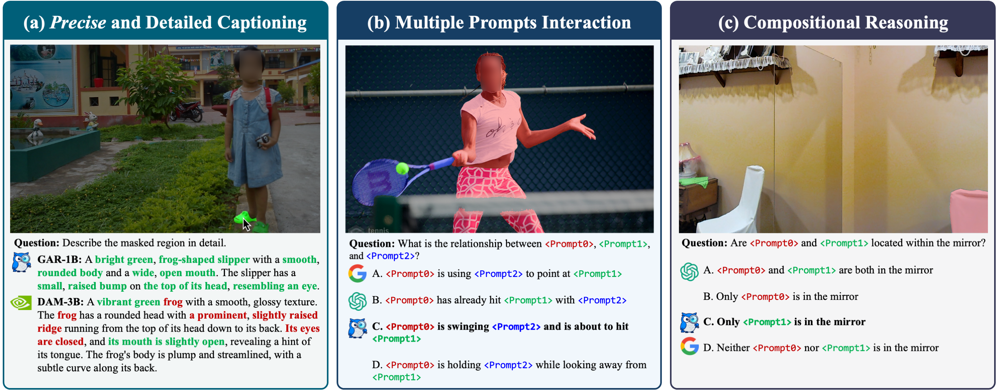
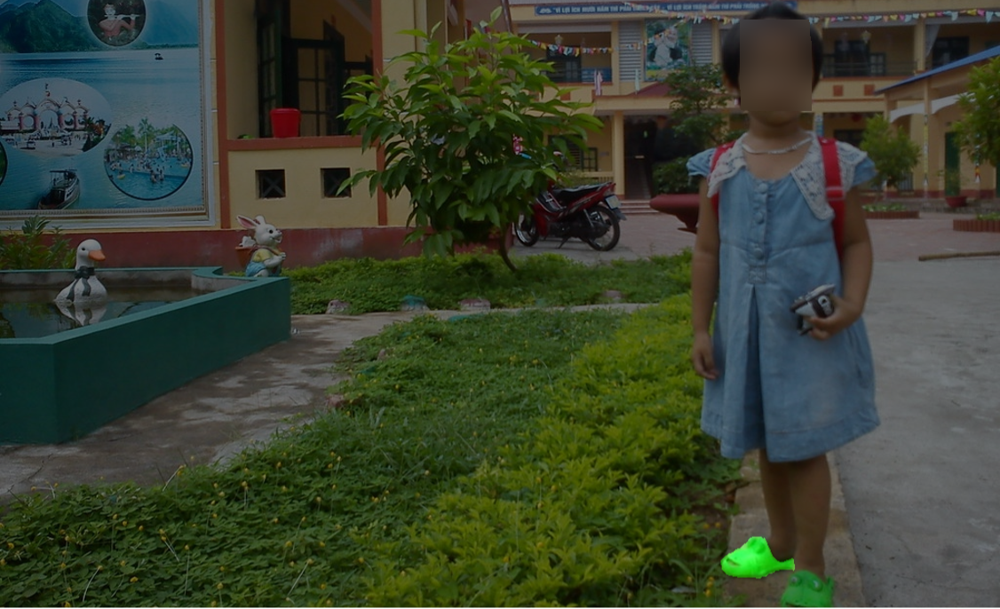
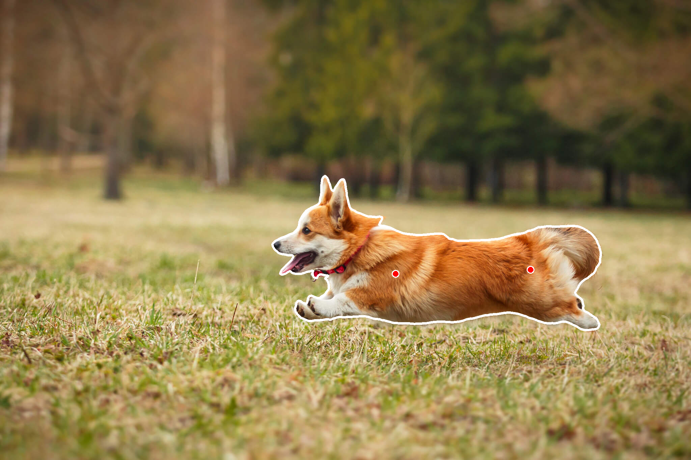
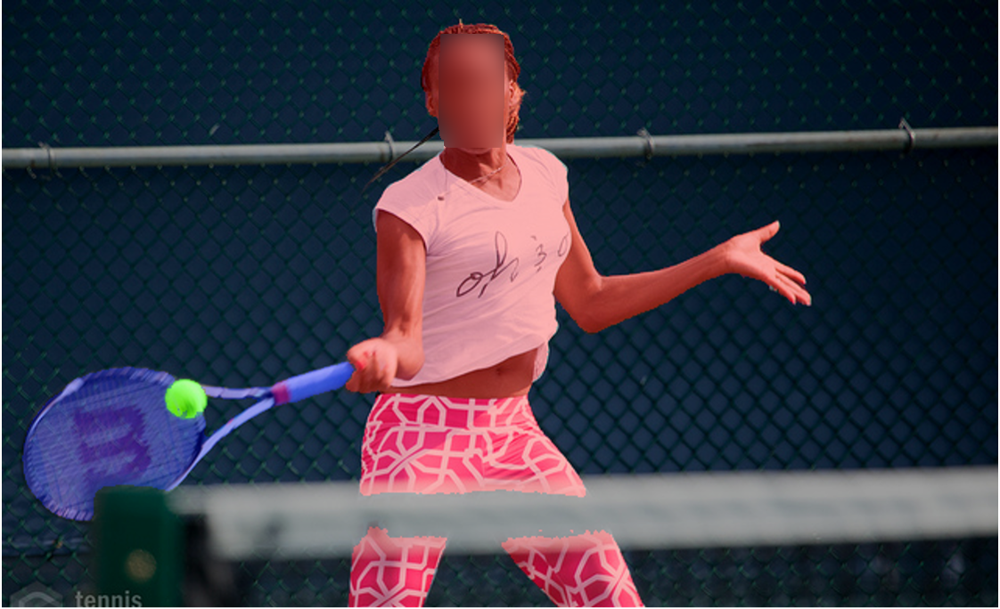

# Grasp Any Region: Towards Precise, Contextual Pixel Understanding for Multimodal LLMs

by
[Haochen Wang](https://haochen-wang409.github.io), 
Yuhao Wang, 
[Tao Zhang](https://scholar.google.com/citations?user=3xu4a5oAAAAJ),
[Yikang Zhou](https://scholar.google.com/citations?user=dZikW2YAAAAJ),
[Yanwei Li](https://yanwei-li.com/),
[Jiacong Wang](https://scholar.google.com/citations?user=rzYgLkgAAAAJ),
[Ye Tian](https://scholar.google.com/citations?user=vUY_PIUAAAAJ),
[Jiahao Meng](https://scholar.google.com/citations?user=NJfjvfIAAAAJ),
[Zilong Huang](https://speedinghzl.github.io/),
[Guangcan Mai](https://scholar.google.com/citations?user=739cUNMAAAAJ),
[Anran Wang](https://sites.google.com/view/anranwang/home),
[Yunhai Tong](https://scholar.google.com/citations?user=T4gqdPkAAAAJ),
Zhuochen Wang,
[Xiangtai Li](https://lxtgh.github.io/), and
[Zhaoxiang Zhang](https://scholar.google.com/citations?user=qxWfV6cAAAAJ).

[[Paper](https://arxiv.org/abs/2510.18876)] | [[HuggingFace](https://huggingface.co/collections/HaochenWang/grasp-any-region-68f7433671030d6ea682f692)] |  [[Citation](#citation)]

**TL; DR**: Our Grasp Any Region (GAR) supports both (1) describing a *single* region of an image or a video in the form of points/boxes/scribbles/masks in detail and (2) understanding *multiple* regions such as modeling interactions and performing complex reasoning. We also release a new benchmark, GARBench, to evaluate models on advanced region-level understanding tasks.



> **Abstract.** While Multimodal Large Language Models (MLLMs) excel at holistic understanding, they struggle
> in capturing the dense world with complex scenes, requiring fine-grained analysis of intricate
> details and object inter-relationships. Region-level MLLMs have been a promising step. However,
> previous attempts are generally optimized to understand given regions in isolation, neglecting
> crucial global contexts. To address this, we introduce Grasp Any Region (GAR) for comprehensive 
> region-level visual understanding. Empowered by an effective RoI-aligned feature replay
> technique, GAR supports (1) precise perception by leveraging necessary global contexts, and (2)
> modeling interactions between multiple prompts. Together, it then naturally achieves (3) advanced
> compositional reasoning to answer specific free-form questions about any region, shifting the
> paradigm from passive description to active dialogue. Moreover, we construct GARBench, which
> not only provides a more accurate evaluation of single-region comprehension, but also, more
> importantly, measures interactions and complex reasoning across multiple regions. Extensive
> experiments have demonstrated that GAR-1B not only maintains the state-of-the-art captioning
> capabilities, e.g., outperforming DAM-3B +4.5 on DLC-Bench, but also excels at modeling rela-
> tionships between multiple prompts with advanced comprehension capabilities, even surpassing
> InternVL3-78B on GARBench-VQA. More importantly, our zero-shot GAR-8B even outperforms
> in-domain VideoRefer-7B on VideoRefer-BenchQ, indicating its strong capabilities can be easily
> transferred to videos.

# Installation

```bash
conda create -n gar python=3.11.2 -y
conda activate gar

pip3 install xtuner==0.2.0rc0
pip3 install -r requirements.txt
pip3 install flash-attn==2.7.4.post1 --no-build-isolation -v
```

# Demos

## Gradio Demo

Please refer to [`demo/gradio/README.md`](demo/gradio/README.md) for serving an online captioning demo using gradio.

## Examples

### Detailed Localized Image Descriptions with Masks

- [`demo/gar_with_mask.py`](demo/gar_with_mask.py) - Command-line tool for processing single images, allowing users to specify specify the region-of-interest using its segmentation mask.

<details>
<summary>Expand to see example commands</summary>



```bash
torchrun --nproc-per-node=1 --master-port=8119 demo/gar_with_mask.py --image_path assets/demo_image_1.png --mask_path assets/demo_mask_1.png
```

**Input instruction:** Describe the masked region in detail.

**Output answer:** A bright green, **frog-shaped slipper** with a smooth, rounded body and a wide, open mouth. The slipper has a small, raised bump on the top of its head, resembling a frog's eye.

</details>

### Detailed Localized Image Descriptions with SAM

- [`demo/gar_with_sam.py`](demo/gar_with_sam.py) - Command-line tool for processing single images using SAM v1, allowing users to specify points or bounding boxes for mask generation

<details>
<summary>Expand to see example commands</summary>



```bash
# You can use it with points or a bounding box for the region of interest.
# SAM is used to turn points or a bounding box into a mask.
# You can also use mask directly, see `demo/gar_with_mask.py`.
torchrun --nproc-per-node=1 --master-port=8119 demo/gar_with_sam.py --image_path assets/demo_image_2.jpg --points '[[1172, 812], [1572, 800]]' --output_image_path output_visualization.png
torchrun --nproc-per-node=1 --master-port=8119 demo/gar_with_sam.py --image_path assets/demo_image_2.jpg --box '[800, 500, 1800, 1000]' --use_box --output_image_path output_visualization.png
```

**Input instruction:** Describe the masked region in detail.

**Output answer:** A medium-sized, short-haired dog with a predominantly tan coat featuring white markings on its face, chest, and paws. The dog has a white stripe running down the center of its face, extending from the forehead to the nose. Its ears are large, pointed, and stand erect. The dog is wearing a red collar with a visible tag. Its mouth is open, revealing its tongue and teeth, and it appears to be in mid-leap with its front legs extended forward and hind legs stretched out behind.

</details>

### Modeling Complex Relationship between Multiple Regions

- [`demo/gar_relationship.py`](demo/gar_relationship.py) - Command-line tool for processing single images with multiple regions-of-interest, allowing users to specify specify the region-of-interest using its segmentation mask

<details>
<summary>Expand to see example commands</summary>



```bash
torchrun --nproc-per-node=1 --master-port=8119 demo/gar_relationship.py --image_path assets/demo_image_3.png --mask_paths "['assets/demo_mask_3_0.png', 'assets/demo_mask_3_1.png', 'assets/demo_mask_3_2.png']" --question_str 'Question: What is the relationship between <Prompt0>, <Prompt1>, and <Prompt2>?\nOptions:\nA. <Prompt0> is using <Prompt2> to point at <Prompt1>\nB. <Prompt0> has already hit <Prompt1> with <Prompt2>\nC. <Prompt0> is swinging <Prompt2> and is about to hit <Prompt1>\nD. <Prompt0> is holding <Prompt2> while looking away from <Prompt1>'
```

**Input instruction:**

```
Question: What is the relationship between <Prompt0>, <Prompt1>, and <Prompt2>?
Options:
A. <Prompt0> is using <Prompt2> to point at <Prompt1>
B. <Prompt0> has already hit <Prompt1> with <Prompt2>
C. <Prompt0> is swinging <Prompt2> and is about to hit <Prompt1>
D. <Prompt0> is holding <Prompt2> while looking away from <Prompt1>
Answer with the correct option's letter directly.
```

**Output answer:** C

Note that `<Prompt0>`, `<Prompt1>`, and `<Prompt2>` are illustrated in <span style="color:#C00000;">red</span>, <span style="color:#00B050;">green</span>, and <span style="color:#0000FF;">blue</span>, respectively.

</details>

# Training

**1. Dataset Preparation**

First, download the dataset:

`hf download HaochenWang/Grasp-Any-Region-Dataset --local-dir data --repo-type dataset`

The overall data structure should be:
```sh
data
├── Fine-Grained-Dataset
│   └── data-*-of-*.arrow
├── Relation-Dataset
│   └── data-*-of-*.arrow
└── Seed-Dataset
    └── data-*-of-*.arrow
```

**2. Launch Training**

Next, run the following script to train using 8 GPUS:

`bash tools/dist.sh train projects/grasp_any_region/configs/gar_1b.py 8`

**3. Convert to HuggingFace Format**

```python3 projects/grasp_any_region/hf_models/convert_to_hf.py projects/grasp_any_region/configs/gar_1b.py --pth-model PATH_TO_PTH_MODEL --save-path PATH_TO_SAVE_FOLDER```

Note that this script only convert the checkpoint and some `*.py` files requires manually copy to `${PATH_TO_SAVE_FOLDER}`.

# Evaluation

Please refer to [`evaluation/EVALUATION.md`](evaluation/EVALUATION.md).

# License

This project is licensed under the [Apache-2.0 License](LICENSE).

# Citation

If you use our work or our implementation in this repo, or find them helpful, please consider giving a citation in the following format.

```
@article{wang2025grasp,
  title={Grasp Any Region: Prompting MLLM to Understand the Dense World}, 
  author={Haochen Wang and Yuhao Wang and Tao Zhang and Yikang Zhou and Yanwei Li and Jiacong Wang and Ye Tian and Jiahao Meng and Zilong Huang and Guangcan Mai and Anran Wang and Yunhai Tong and Zhuochen Wang and Xiangtai Li and Zhaoxiang Zhang},
  journal={arXiv preprint arXiv:2510.18876},
  year={2025}
}
```

# Acknowledgements

We would like to thank the following projects for their contributions to this work:

- [SAM](https://github.com/facebookresearch/segment-anything)
- [DAM](https://github.com/NVlabs/describe-anything)
- [Sa2VA](https://github.com/bytedance/Sa2VA)